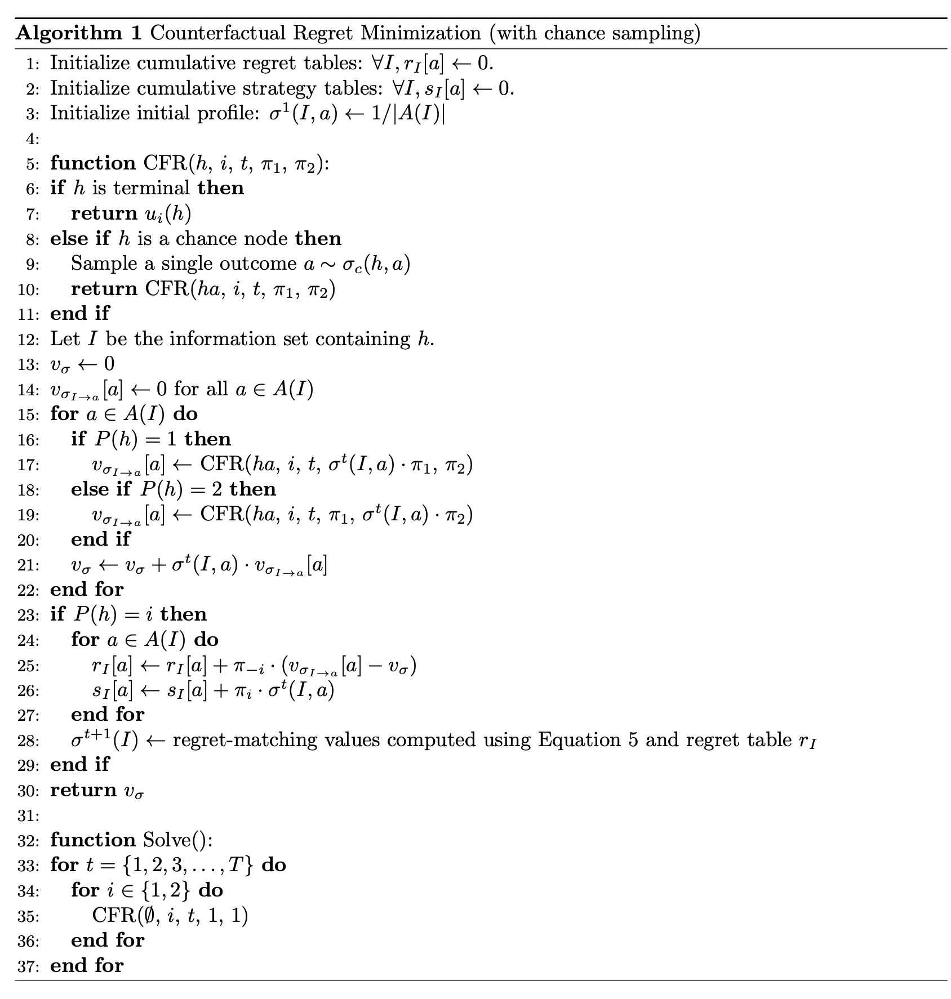

## CFR Bot Design Doc

# CFR Algorithm

# Hand Buckets

Use n=10 hierarchical buckets:

Preflop = ([0,1], [1,n])
where x[0] = bounty bool, x[1] = hand strength based on monte carlo winrates using a lookup table

Flop = ([0,1], [1,n], [1,n+2])
where x[0] = bounty bool, x[1] = bucket from preflop, x[2] = handstrength based on eval7 score (n+1, n+2 = low-strength, high-potential)

Turn = ([0,1], [1,n], [1,n+2], [1,n+2])
where x[0] = bounty bool, x[1] = bucket from preflop, x[2] = bucket from flop, x[3] = handstrength based on eval7 score (n+1, n+2 = low-strength, high-potential)

River = ([0,1], [1,n], [0,n+2], [0,n+2], [0,n])
where x[0] = bounty bool, x[1] = bucket from preflop, x[2] = bucket from flop, x[3] = bucket from turn, x[4] = handstrength based on eval7 score

Bucket handstrength ranges:

Preflop = []

Flop = []

Turn = []

River = []

Potential Function:

n+1 = straight/flush draw, highcard
n+2 = straight/flush draw, pair

# Action Buckets

- Call
- Fold
- Check
- Raise (min raise, 1/3 pot, 1/2 pot, full pot, 1.5 pot, 2 pot, max raise/all in)

# Implementation Details

- create a custom poker engine to train bot using cfr
- persist weights as csv and read them into a matrix at runtime
- use potential function and bucketer function during runtime to determine which information set we are at and sample from strategy weights accordingly
- if for some reason infoset not in strats, do a random action?

# Other Ideas

- base bot weights that are loaded in each game and have the bot do "fine tunes" within each game (1000 rounds) or even for each bot

# TODO

- ~condense hole winrates to have 169 entries (Brian)~
- ~make potential function (Brian)~
- ~make bucketer function (Brian)~

- make custom poker engine for training (Brian and Grace)
  - ~write basic poker game (similar parameters to engine) (Grace)~
  - ~add variant (Grace)~
  - ~spec cfr related areas (Grace)~
  - ~utility function~
  - ~legal actions~
  - ~determining if node is chance, p1, p2, or terminal~
  - ~sampling chance node outcome~
  - ~structure of information set~
  - ~P(h)~
- code cfr algo (Brian)

  - structure of history
  - reach probabilities for 1 and p2
  - framework
  - cumulative regret and strategy and current strategy tables
  - regret function

- determine handstrength ranges (data analysis) (food for thought: we will never "downgrade" buckets) (Brian and Grace)
- store regrets into csv and print to analyze training
- run and save averaged strategy into a csv (Brian)
- spec data structures and create load function for persisted weights (runtime) (Grace)
- runtime algo (potentially add ingame learning/finetuning) (Brian and Grace)
